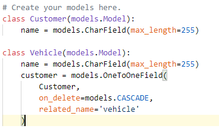
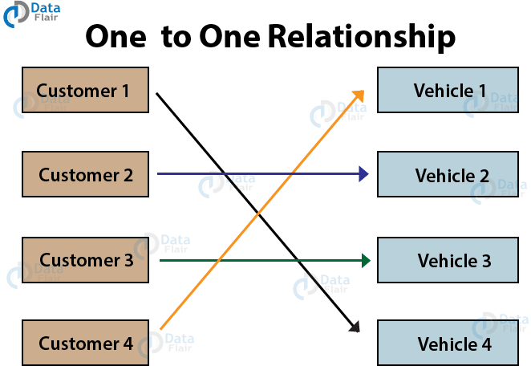
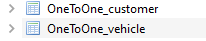
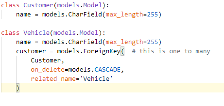
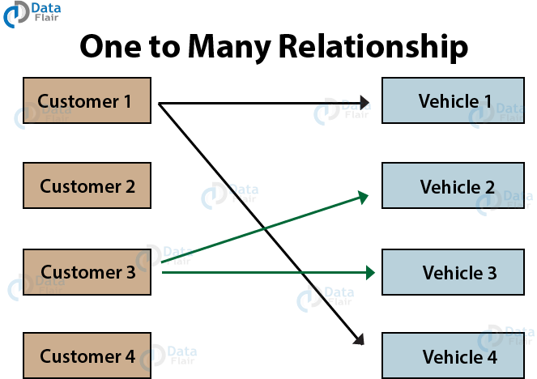
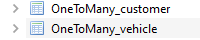
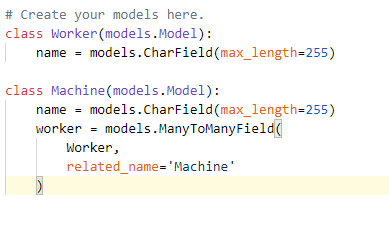
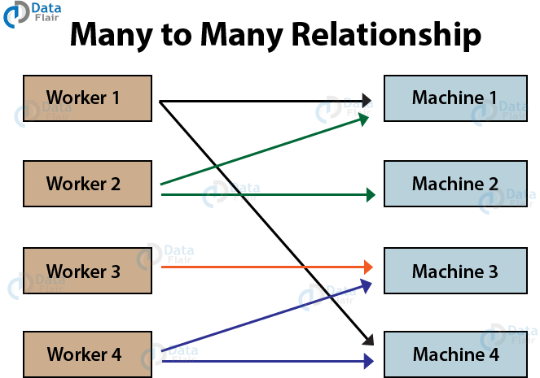
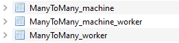
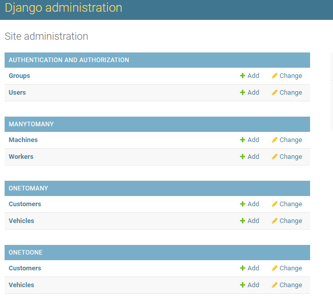

# Django ORM 
## Model One To One 
- First we code build a model one to one : it mean every customer owns only one vehicle. Thus, a one-to-one relationship exists.

- This is how model mean :

- Database : 

## Model One To Many 
- Model : 

- This is how model mean : A one to many relationships is where one object from table1 can have multiple relations with entities in table2. Although, table2 objects will have only one relation to the object of table1.

- Database : 

## Model Many To Many 
- Model : 

- Here we have multiple workers for multiple machines. A worker can be assigned to operate more than one machine. Also, a machine can be operated by multiple workers one at a time.

- This is a special case of relationships. Many to Many Relationship requires a separate table. There they store objects related to other objects.
- Database : 

## Full in Admin 

