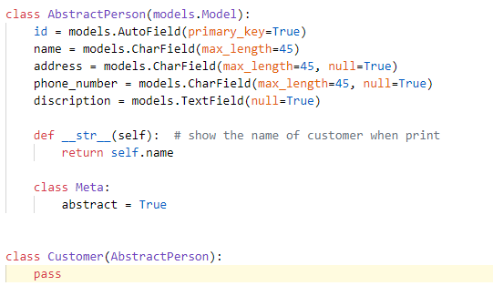
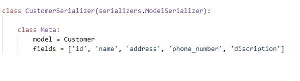
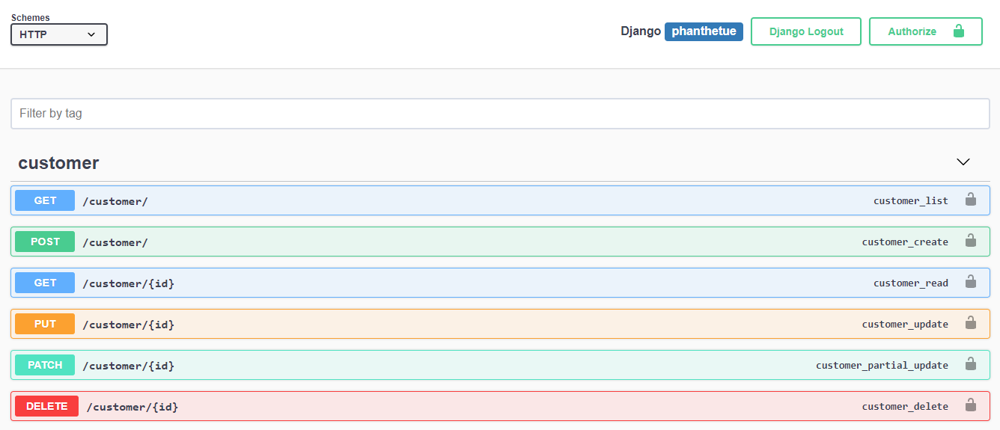
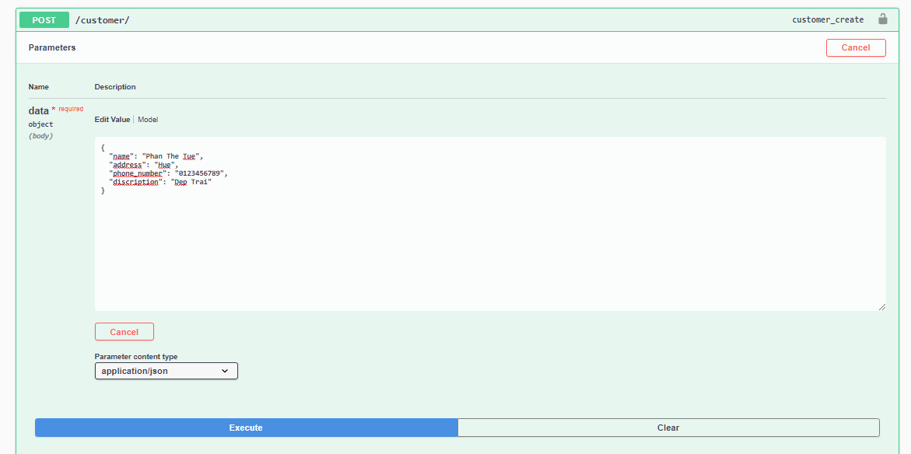
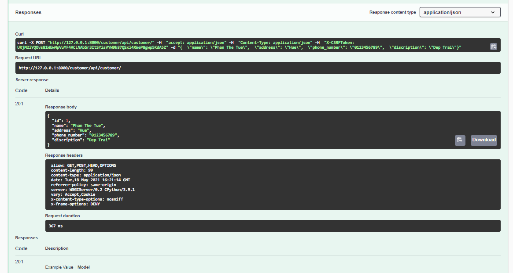
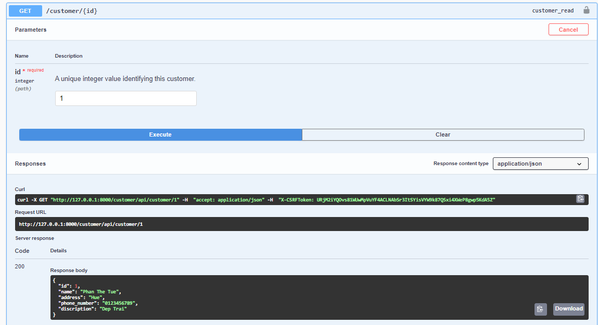
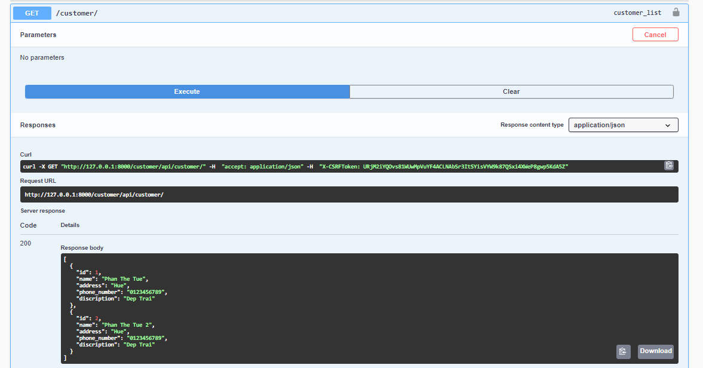
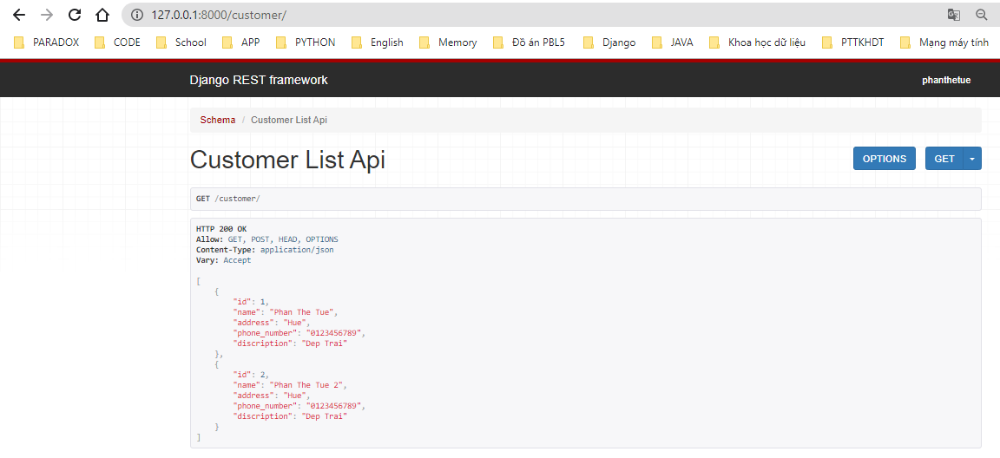
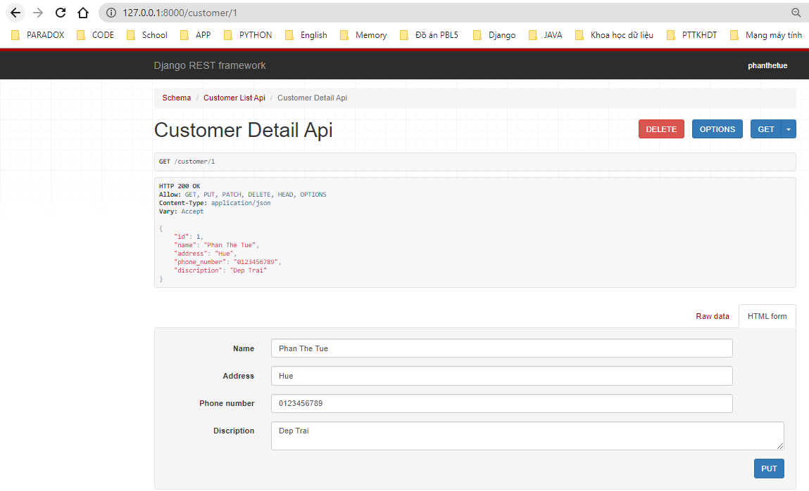

# API and how to build it 
## Build Model and Srializer class
- Build Model :

- Build Srializer : 

## Schema View 
- You can see how to build schema view in url 

- Test with POST request

- And Response of it : 

- Or test with GET request:
    - GET One Objects  : 
    
    - GET All Objects  : 
    

- Now we can use the rest_framework as usual : 
    - Customer API get all : 
    
    - Customer API get one : 
    
