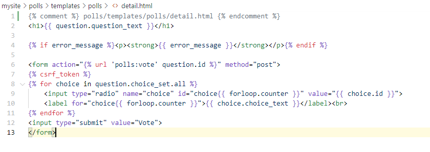
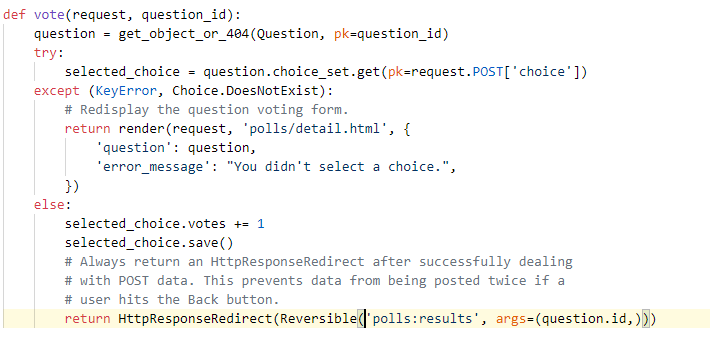
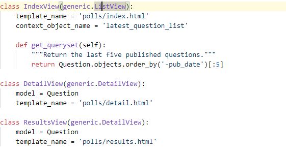
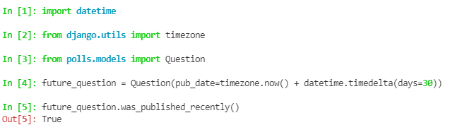
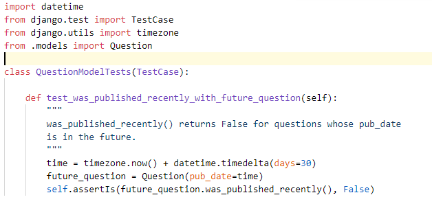
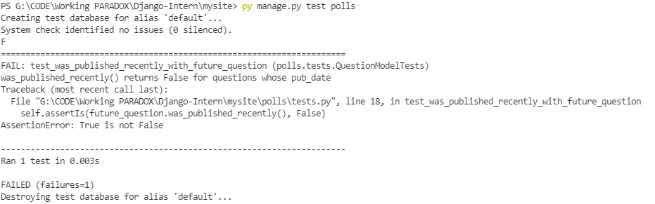
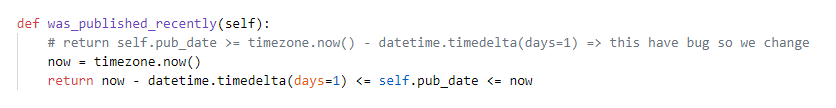
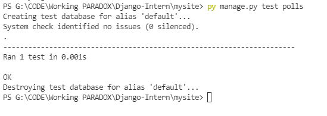

# Django-Intern

## Tutorial 3
Overview
A view is a “type” of Web page in your Django application that generally serves a specific function and has a specific template. The following views of this project is :

Blog homepage – displays the latest few entries.  
Entry “detail” page – permalink page for a single entry.  
Year-based archive page – displays all months with entries in the given year. 
Month-based archive page – displays all days with entries in the given month. 
Day-based archive page – displays all entries in the given day. 
Comment action – handles posting comments to a given entry. 
In our poll application, we’ll have the following four views: 

Question “index” page – displays the latest few questions. 
Question “detail” page – displays a question text, with no results but with a form to vote. 
Question “results” page – displays results for a particular question. 
Vote action – handles voting for a particular choice in a particular question. 

## Tutorial 4 : 

Write a minima form : 

Working with POST method : 

request.POST is a dictionary-like object that lets you access submitted data by key name.  
In this case, request.POST['choice'] returns the ID of the selected choice, as a string.  
request.POST values are always strings.  

request.POST['choice'] will raise KeyError if choice wasn’t provided in POST data.  
The above code checks for KeyError and redisplays the question form with an error message if choice isn’t given.  

After incrementing the choice count, the code returns an HttpResponseRedirect rather than a normal HttpResponse. HttpResponseRedirect takes a single argument: the URL to which the user will be redirected (see the following point for how we construct the URL in this case). 

We are using the reverse() function in the HttpResponseRedirect constructor in this example.  
This function helps avoid having to hardcode a URL in the view function. It is given the name of the view that we want to pass control to and the variable portion of the URL pattern that points to that view. In this case, using the URLconf we set up in Tutorial 3, this reverse() call will return a string like

We can change for better code by using Generic View :   
   
By using Generic view we can save time and energy and it more efficient about your code. 

This is end Tutorial 4 

## Tutorial 5
Now we change to Part 5 : Automated Testing   
We all know why we have to use Test so now we have some information about way to test : 
https://en.wikipedia.org/wiki/Test-driven_development  

## First Test is about Identify Bug
First , we got some problem about day publish : 
   

Something wrong Right ?  
So we create a auto test like this : 
   
And The bug here : 
   
And now we have to solve this bug :  
   
Now the bug has been fixed :  
   

So what all Django have done : 
    manage.py test polls looked for tests in the polls application  
    it found a subclass of the django.test.TestCase class  
    it created a special database for the purpose of testing  
    it looked for test methods - ones whose names begin with test  
    in test_was_published_recently_with_future_question it created a Question instance whose pub_date field is 30 days in the future  
    … and using the assertIs() method, it discovered that its was_published_recently() returns True, though we wanted it to return False  

After this we have some bug have to fix in :  
    Client Action  
    URL pattern  