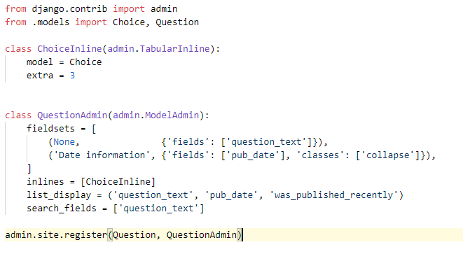
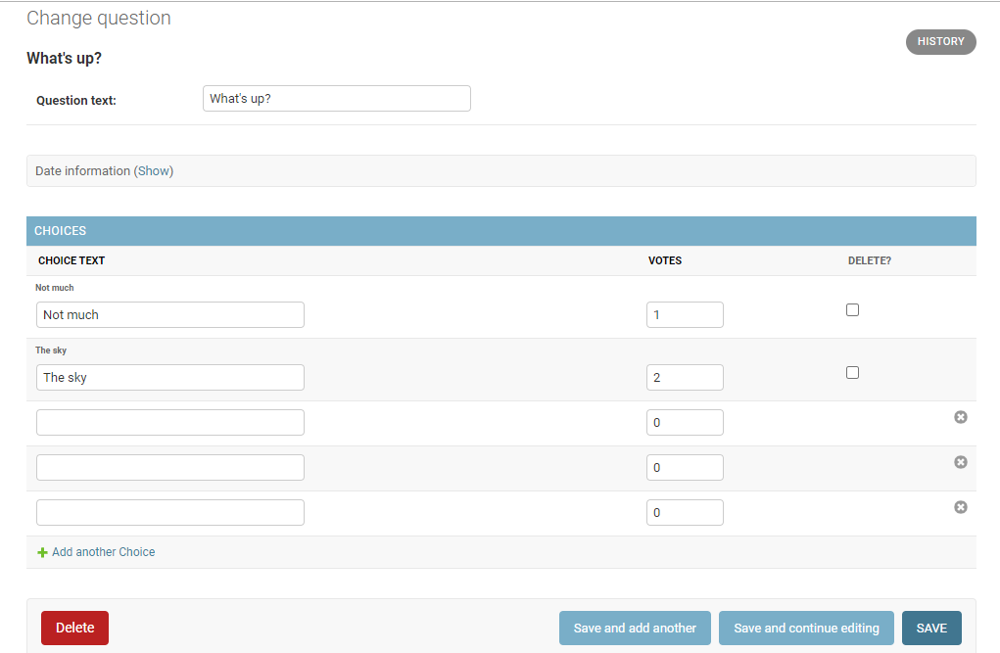
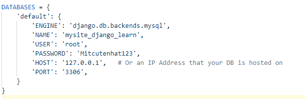

# Django-Intern
## Tutorial 1 
### Create Project 
django-admin startproject mysite  
- The outer mysite/ root directory is a container for your project. Its name doesn’t matter to Django; you can rename it to anything you like.  
- manage.py: A command-line utility that lets you interact with this Django project in various ways. You can read all the details about manage.py in django-admin and manage.py.  
- The inner mysite/ directory is the actual Python package for your project. Its name is the Python package name you’ll need to use to import anything inside it (e.g. mysite.urls).  
- mysite/__init__.py: An empty file that tells Python that this directory should be considered a Python package. If you’re a Python beginner, read more about packages in the official Python docs.  
- mysite/settings.py: Settings/configuration for this Django project. Django settings will tell you all about how settings work.  
- mysite/urls.py: The URL declarations for this Django project; a “table of contents” of your Django-powered site. You can read more about URLs in URL dispatcher.  
- mysite/asgi.py: An entry-point for ASGI-compatible web servers to serve your project. See How to deploy with ASGI for more details.  

### Create Poll app : 
python manage.py startapp polls  
### Creating an admin user
python manage.py createsuperuser

## Tutorial 2
### Database set up : 
python manage.py migrate  

### Create model and add Installed APP
python manage.py makemigrations polls  
python manage.py migrate  

## Tutorial 3
Overview
A view is a “type” of Web page in your Django application that generally serves a specific function and has a specific template. The following views of this project is :

- Blog homepage – displays the latest few entries.  
- Entry “detail” page – permalink page for a single entry.  
- Year-based archive page – displays all months with entries in the given year. 
- Month-based archive page – displays all days with entries in the given month. 
- Day-based archive page – displays all entries in the given day. 
- Comment action – handles posting comments to a given entry. 
- In our poll application, we’ll have the following four views: 

Question “index” page – displays the latest few questions. 
Question “detail” page – displays a question text, with no results but with a form to vote. 
Question “results” page – displays results for a particular question. 
Vote action – handles voting for a particular choice in a particular question. 

## Tutorial 4 : 

Write a minima form : 

Working with POST method : 

- request.POST is a dictionary-like object that lets you access submitted data by key name.  
- request.POST['choice'] will raise KeyError if choice wasn’t provided in POST data.  

After incrementing the choice count, the code returns an HttpResponseRedirect rather than a normal HttpResponse. HttpResponseRedirect takes a single argument: the URL to which the user will be redirected (see the following point for how we construct the URL in this case). 

We can change for better code by using Generic View :   
   
By using Generic view we can save time and energy and it more efficient about your code. 

This is end Tutorial 4 

## Tutorial 5
Now we change to Part 5 : Automated Testing   
We all know why we have to use Test so now we have some information about way to test : 
https://en.wikipedia.org/wiki/Test-driven_development  

## First Test is about Identify Bug
First , we got some problem about day publish : 
   

Something wrong Right ?  
So we create a auto test like this : 
   
And The bug here : 
   
And now we have to solve this bug :  
   
Now the bug has been fixed :  
   

So what all Django have done : 
- manage.py test polls looked for tests in the polls application  
- it found a subclass of the django.test.TestCase class  
- it created a special database for the purpose of testing  
- it looked for test methods - ones whose names begin with test  
- in test_was_published_recently_with_future_question it created a Question instance whose pub_date field is 30 days in the future  
- … and using the assertIs() method, it discovered that its was_published_recently() returns True, though we wanted it to return False  

After this we have some bug have to fix in :  
- Client Action  
- URL pattern  

This is end Tutorial 5 

## Tutorial 6
### Add Static 
Create static in polls then change color and background   
- In static we will have image , style.css and template

## Tutorial 7 
### About Custom your Admin Site : 

First we have to build an admin site :  
   

And we got view of this :  
   

Something i have learn : 
- Using an app and connect class in class to one ( this is the most important)
- Using inline
- How to REUSAGE APP ( very important)

## Connect MySQL 
   

Then migrate :  
   

# Create and Using API 
- [Learning API](LearningAPI/README.md)

# Django ORM
- [Django-ORM](Django_ORM/README.md)